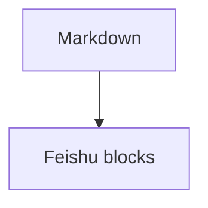

# Markdown To Feishu Smoke

This paragraph has **bold text**, *italic text*, `inline_code`, and an external link: [OpenAI](https://openai.com).

| Feature | Expected result | Note |
| --- | --- | --- |
| Table | Field-list rows | Avoid broken pipe tables in Feishu |
| Code | `run_turn` | Keep underscores |

```typescript
type Turn = {
  next_input: string;
};
```

```rust
pub(crate) async fn run_turn<T>() {
    let html = "<div>keep me</div>";
}
```


